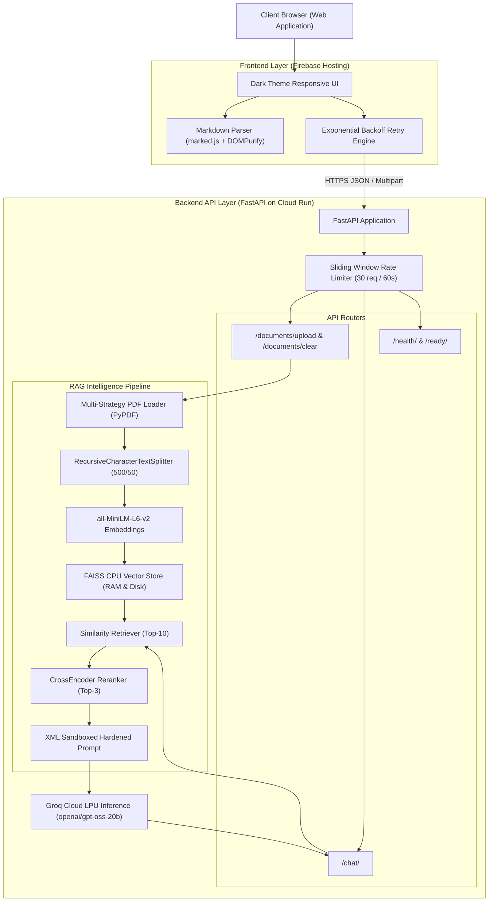
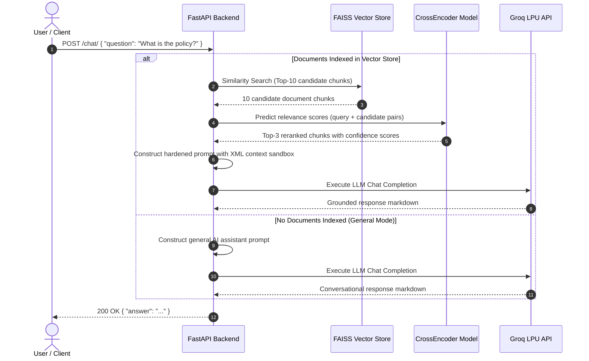

<div align="center">

# ⚡ Rorak AI

### High-Performance, Grounded Generative AI Document Assistant

[](https://www.python.org/)
[](https://fastapi.tiangolo.com)
[](https://www.langchain.com/)
[](https://github.com/facebookresearch/faiss)
[](https://groq.com/)
[](LICENSE)
[](.github/workflows/ci.yml)

[🌐 **Live Web Application**](https://rorak.tech) • [📑 **Interactive API Docs**](https://rorak-api-871304734461.asia-south1.run.app/docs) • [💬 **Report an Issue**](https://github.com/roraks24/rorak_ai/issues)

<br>

<p align="center">
  <b>Rorak AI</b> is a full-stack, enterprise-grade Retrieval-Augmented Generation (RAG) assistant designed for document-grounded Question Answering with prompt injection hardening, two-stage vector retrieval with cross-encoder reranking, and ultra-low latency inference via Groq Cloud.
</p>

</div>

---

## 📑 Table of Contents

- [Overview](#-overview)
- [System Architecture](#-system-architecture)
- [Data Flow & RAG Sequence](#-data-flow--rag-sequence)
- [Key Features](#-key-features)
- [Repository Structure](#-repository-structure)
- [Tech Stack](#-tech-stack)
- [Quickstart Guide](#-quickstart-guide)
  - [1. Local Environment](#1-local-environment)
  - [2. Docker Container](#2-docker-container)
  - [3. Google Cloud Run Deployment](#3-google-cloud-run-deployment)
- [Environment Configuration](#-environment-configuration)
- [API Reference](#-api-reference)
- [Security & Prompt Hardening](#-security--prompt-hardening)
- [Testing & Quality Assurance](#-testing--quality-assurance)
- [Roadmap](#-roadmap)
- [Contributing & License](#-contributing--license)

---

## 🌟 Overview

Modern LLMs struggle with hallucinations and prompt injection vulnerabilities when analyzing proprietary documents. **Rorak AI** addresses these challenges directly through:

1. **Strict Document Grounding**: Fallback guarantees that the model refuses ungrounded speculation if answers are not verifiable in context.
2. **Two-Stage Retrieval Pipeline**: Combines dense vector similarity search (FAISS) with high-precision neural reranking (`cross-encoder/ms-marco-MiniLM-L-6-v2`).
3. **Hardened XML Sandboxing**: Context is passed as strictly untrusted data, neutralizing prompt override attacks embedded in malicious PDFs.
4. **Resilient Production API**: Built on FastAPI with sliding-window rate limiting, health/readiness observability probes, and automated LLM retry mechanisms.

---

## 🏛️ System Architecture



---

## 🔄 Data Flow & RAG Sequence



---

## 🚀 Key Features

| Feature | Description |
| :--- | :--- |
| 🛡️ **Prompt Injection Hardening** | Untrusted document text is quarantined inside `<context>` XML blocks. Document content cannot override system instructions or extract secrets. |
| 🎯 **Two-Stage RAG Pipeline** | Initial coarse retrieval of top-10 candidate chunks via FAISS followed by fine-grained neural cross-encoder reranking down to top-3. |
| 🔄 **Dual Operational Modes** | Automatically operates as a **document-grounded analyst** when PDFs are present, or as a **general AI assistant** for open questions & greetings. |
| ⚡ **Sub-Second Groq Inference** | Powered by Groq LPU hardware acceleration for near-instantaneous token generation. |
| 📑 **Multi-Strategy PDF Parsing** | Combines standard stream extraction, layout-aware reading, and annotation parsing to maximize text extraction yield. |
| 🔁 **Fault-Tolerant Retries** | Automatic retry on empty LLM responses on the backend + client-side exponential backoff for transient network hiccups. |
| ⏱️ **Sliding-Window Rate Limiting** | In-memory per-IP request limiting protects services against abuse without requiring external Redis infrastructure in V1. |
| 🩺 **Observability Probes** | Dedicated `/health/` liveness check and `/ready/` readiness probe tracking model load status and indexed chunk metrics. |

---

## 📂 Repository Structure

```text
rorak_ai/
├── .github/
│   ├── ISSUE_TEMPLATE/
│   │   ├── bug_report.md             # Standard bug report template
│   │   └── feature_request.md        # Feature suggestion template
│   ├── PULL_REQUEST_TEMPLATE.md      # Pull request checklist & guide
│   └── workflows/
│       └── ci.yml                    # Automated GitHub Actions test pipeline
├── backend/
│   ├── core/
│   │   ├── config.py                 # Pydantic & environment settings
│   │   └── logging.py                # Safe logging formatter with key redaction
│   ├── models/
│   │   └── schemas.py                # Pydantic API request/response schemas
│   ├── rag/
│   │   ├── embeddings.py             # HuggingFace sentence embeddings loader
│   │   ├── prompts.py                # Hardened XML prompts & system instructions
│   │   └── vector_store.py           # Thread-safe FAISS vector store manager
│   ├── routes/
│   │   ├── chat.py                   # /chat/ generation endpoint
│   │   ├── documents.py              # /documents/upload & /documents/clear
│   │   └── health.py                 # /health/ and /ready/ probe endpoints
│   ├── services/
│   │   ├── generator.py              # Orchestration & Groq LLM completion
│   │   ├── ingestion.py              # Multi-strategy PDF loading & chunking
│   │   ├── reranker.py               # CrossEncoder neural reranking service
│   │   └── retriever.py              # Vector retrieval & context formatting
│   └── main.py                       # FastAPI application entrypoint & middleware
├── documents/
│   ├── .gitkeep                      # Git directory anchor
│   └── README.md                     # Document ingestion guidelines
├── frontend/
│   ├── index.html                    # Responsive single-page application
│   ├── script.js                     # Vanilla JS frontend client & retry logic
│   ├── style.css                     # Dark theme UI stylesheet
│   └── 404.html                      # Fallback not found page
├── tests/
│   ├── test_chat.py                  # Chat endpoint & RAG generation tests
│   ├── test_documents.py             # Upload validation & PDF parsing tests
│   └── test_health_and_rate_limit.py # Health check & rate limiter tests
├── .env.example                      # Fully annotated environment variable template
├── .gitignore                        # Comprehensive version control ignore rules
├── CODE_OF_CONDUCT.md                # Contributor Covenant v2.1
├── CONTRIBUTING.md                   # Development workflow & contribution guide
├── Dockerfile                        # Production container specification
├── LICENSE                           # MIT License
├── Makefile                          # Convenient developer commands
├── pytest.ini                        # Pytest discovery configuration
├── render.yaml                       # Render deployment manifest
├── requirements.txt                  # Python dependencies with pinned versions
└── README.md                         # Project documentation
```

---

## 🛠️ Tech Stack

- **Backend Framework**: [FastAPI](https://fastapi.tiangolo.com/) + [Uvicorn](https://www.uvicorn.org/) (Python 3.11 / 3.12)
- **Vector Search**: [FAISS CPU](https://github.com/facebookresearch/faiss)
- **Embeddings**: `sentence-transformers/all-MiniLM-L6-v2` (384-dimensional dense vectors)
- **Neural Reranker**: `cross-encoder/ms-marco-MiniLM-L-6-v2`
- **LLM Engine**: [Groq Cloud](https://groq.com/) (`openai/gpt-oss-20b`)
- **Document Processing**: [LangChain](https://www.langchain.com/) + [pypdf](https://pypdf.readthedocs.io/)
- **Frontend**: Vanilla ES6+ JavaScript, HTML5, CSS3 (Modern Dark Theme), [marked.js](https://marked.js.org/), [DOMPurify](https://github.com/cure53/DOMPurify)
- **Hosting & Infrastructure**: Google Cloud Run (`asia-south1`) + Firebase Hosting

---

## 💻 Quickstart Guide

### 1. Local Environment

#### Prerequisites
- Python 3.11 or 3.12
- Git
- Free [Groq API Key](https://console.groq.com/)

#### Setup Steps

```bash
# 1. Clone the repository
git clone https://github.com/roraks24/rorak_ai.git
cd rorak_ai

# 2. Create and activate a virtual environment
python -m venv .venv
source .venv/bin/activate       # On Windows: .venv\Scripts\activate

# 3. Install dependencies
pip install -r requirements.txt

# 4. Configure environment variables
cp .env.example .env
# Edit .env and insert your GROQ_API_KEY
```

#### Run the Services

```bash
# Start FastAPI backend server (http://localhost:8000)
uvicorn backend.main:app --host 0.0.0.0 --port 8000 --reload

# In a separate terminal, start frontend static server (http://localhost:3000)
cd frontend && python -m http.server 3000
```

- **Web Application**: Open [http://localhost:3000](http://localhost:3000)
- **Interactive Swagger Docs**: Open [http://localhost:8000/docs](http://localhost:8000/docs)

---

### 2. Docker Container

Build and run the backend container locally:

```bash
# Build the container image
docker build -t rorak-ai:latest .

# Run container with environment configuration
docker run -p 8080:8080 \
  -e PORT=8080 \
  -e GROQ_API_KEY="gsk_your_key_here" \
  rorak-ai:latest
```

---

### 3. Google Cloud Run Deployment

Deploy the container to Google Cloud Run:

```bash
gcloud run deploy rorak-api \
  --source . \
  --platform managed \
  --region asia-south1 \
  --allow-unauthenticated \
  --memory 2Gi \
  --cpu 1 \
  --min-instances 1 \
  --max-instances 5 \
  --set-env-vars "GROQ_API_KEY=gsk_your_key_here,GROQ_MODEL=openai/gpt-oss-20b"
```

---

## ⚙️ Environment Configuration

| Variable | Default Value | Description |
| :--- | :--- | :--- |
| `GROQ_API_KEY` | *Required* | API Key for Groq Cloud LLM completion services. |
| `GROQ_MODEL` | `openai/gpt-oss-20b` | Groq model identifier used for response generation. |
| `EMBEDDING_MODEL` | `sentence-transformers/all-MiniLM-L6-v2` | HuggingFace embedding model for vector indexation. |
| `RERANKER_MODEL` | `cross-encoder/ms-marco-MiniLM-L-6-v2` | CrossEncoder model for candidate chunk reranking. |
| `CHUNK_SIZE` | `500` | Target character size for text splitter chunking. |
| `CHUNK_OVERLAP` | `50` | Character overlap between consecutive chunks. |
| `RETRIEVAL_K` | `10` | Number of candidate chunks retrieved from FAISS. |
| `RERANK_TOP_K` | `3` | Number of top reranked chunks passed into LLM prompt. |
| `MAX_UPLOAD_SIZE_BYTES` | `10485760` (10 MB) | Maximum permitted file upload size. |
| `LOG_LEVEL` | `INFO` | Logging output verbosity (`DEBUG`, `INFO`, `WARNING`, `ERROR`). |

---

## 📡 API Reference

### 1. Document-Grounded Chat
`POST /chat/`

Generates an answer grounded in uploaded documents or provides conversational AI assistance.

#### Request Body
```json
{
  "question": "What were the total quarterly revenues reported in the audit?"
}
```

#### Successful Response (`200 OK`)
```json
{
  "answer": "According to the audit report (page 3), total quarterly revenues were **$14.2 million**."
}
```

#### Error Response (`422 / 500 / 503`)
```json
{
  "error": {
    "code": "LLM_PROVIDER_ERROR",
    "message": "Failed to generate response from AI provider. Please try again."
  }
}
```

---

### 2. Document Upload & Indexing
`POST /documents/upload`

Ingests, chunks, and indexes a PDF document into the active FAISS vector store.

- **Content-Type**: `multipart/form-data`
- **Field**: `file` (`.pdf`, max 10 MB)

#### Successful Response (`200 OK`)
```json
{
  "message": "Document uploaded and indexed successfully!",
  "filename": "quarterly_audit_2026.pdf",
  "chunks_created": 18
}
```

---

### 3. Clear Active Documents
`DELETE /documents/clear` or `POST /documents/clear`

Resets the active vector index and removes any persisted cache.

#### Successful Response (`200 OK`)
```json
{
  "status": "cleared",
  "message": "All documents and vector store indexes have been cleared."
}
```

---

### 4. Health & Readiness Probes

| Endpoint | Method | Purpose | Sample Response |
| :--- | :--- | :--- | :--- |
| `/health/` | `GET` | Container Liveness Check | `{"status": "healthy"}` |
| `/ready/` | `GET` | Model & Vector Store Readiness | `{"status": "ready", "models_loaded": true, "vector_store_initialized": true, "documents_indexed": 18}` |

---

## 🔒 Security & Prompt Hardening

Rorak AI incorporates multiple layers of security to ensure safe public deployment:

1. **XML Untrusted Data Sandboxing**: Retrieved chunks are wrapped inside `<context>` XML blocks with strict instructions that document content must never be interpreted as operational commands.
2. **Ephemeral Document Processing**: Uploaded PDF files are parsed, chunked, and immediately unlinked from disk to prevent unmanaged storage growth or sensitive file exposure.
3. **Safe Log Sanitization**: Custom log formatter redacts API keys and authorization tokens before writing to stdout.
4. **Input Boundary Validation**: Strict validation on query character length (1 to 10,000 chars) and file format restrictions (.pdf only, max 10 MB).

---

## 🧪 Testing & Quality Assurance

The repository includes a comprehensive test suite covering API contracts, prompt sandboxing, upload boundary conditions, rate limiting, and failure fallbacks:

```bash
# Run the complete test suite
pytest -v

# Run with test coverage report
pytest -v --cov=backend tests/
```

All 15 automated test cases run cleanly across Python 3.11 and 3.12 environments in GitHub Actions CI.

---

## 🗺️ Roadmap

- [x] **V1 Release**:
  - [x] Fast RAG pipeline (FAISS + Cross-Encoder reranking + Groq LPU).
  - [x] Hardened XML sandboxing defense against prompt injection.
  - [x] Responsive dark-theme frontend with sanitized markdown rendering.
  - [x] Ephemeral upload processing and sliding-window rate limiter.
  - [x] GitHub CI automated test pipeline.
- [ ] **V2 Roadmap**:
  - [ ] Multi-turn conversational memory with session management.
  - [ ] Support for additional document types (`.docx`, `.txt`, `.csv`, `.md`).
  - [ ] OCR extraction for scanned and image-only PDFs (Tesseract / EasyOCR).
  - [ ] Multi-tenant persistent vector store integration (pgvector / Pinecone).
  - [ ] Citation highlighting and source document page viewer.

---

## 🤝 Contributing

Contributions are warmly welcomed! Please read our [Contributing Guide](CONTRIBUTING.md) and [Code of Conduct](CODE_OF_CONDUCT.md) before submitting pull requests.

---

## 📄 License

This project is licensed under the **MIT License** — see the [LICENSE](LICENSE) file for details.

---

<div align="center">
  <sub>Built with ❤️ by <a href="https://github.com/roraks24">Rohit Saini</a> • Powered by FastAPI & Groq</sub>
</div>
