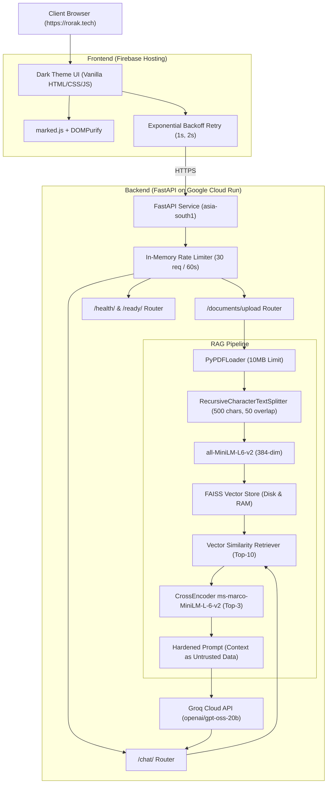

# Rorak AI — Generative AI Document Assistant (V1)

Rorak AI ([rorak.tech](https://rorak.tech)) is a full-stack Generative AI Document Assistant designed for document-grounded Question Answering and exploration.

---

## 🏛️ System Architecture



---

## 🚀 Key Features in V1

1. **Strict Document Grounding**: If the uploaded documents do not contain sufficient context, Rorak immediately returns a controlled answer (*"I couldn't find this information in the uploaded document."*) rather than hallucinating from ungrounded general knowledge.
2. **Prompt Injection Hardening**: Context is treated strictly as **UNTRUSTED DATA** inside `<context>` XML blocks. Document text cannot override system rules or extract system prompts/credentials.
3. **Empty LLM Response Resilience**: Automated single-retry mechanism when the LLM provider returns empty content, avoiding blank UI responses.
4. **Rich Markdown & Safe Rendering**: Fully formatted tables, code blocks, lists, blockquotes, and headers rendered with `marked.js` and sanitized via `DOMPurify`.
5. **Transient Network Resilience**: Frontend automatically handles transient server hiccups with exponential backoff retries (1s, 2s).
6. **Upload Validation**: Enforces 10 MB maximum file size, `.pdf` extension check, non-empty content validation, corrupt PDF detection, and safe filename handling.
7. **Observability & Health Probes**:
   - `GET /health/`: Lightweight liveness check.
   - `GET /ready/`: Readiness probe checking model status and indexed chunk count.
   - Lifespan startup telemetry measuring exact model load times (`time.perf_counter()`).

---

## 🛠️ Tech Stack

- **Frontend**: HTML5, CSS3 (Dark Theme), Vanilla JavaScript (ES6+), `marked.js`, `DOMPurify`, Firebase Hosting.
- **Backend API**: Python 3.11/3.12, FastAPI, Uvicorn, Pydantic.
- **RAG & Vector Search**: LangChain, FAISS CPU, Sentence-Transformers (`all-MiniLM-L6-v2`), Cross-Encoder (`ms-marco-MiniLM-L-6-v2`).
- **LLM Provider**: Groq API (`openai/gpt-oss-20b`).
- **Deployment**: Google Cloud Run (`asia-south1`), Docker.

---

## ⚙️ Environment Variables

Create a `.env` file in the project root:

```env
# Groq LLM API Key
GROQ_API_KEY=gsk_your_groq_api_key_here
GROQ_MODEL=openai/gpt-oss-20b

# Embeddings & Reranker
EMBEDDING_MODEL=sentence-transformers/all-MiniLM-L6-v2
RERANKER_MODEL=cross-encoder/ms-marco-MiniLM-L-6-v2

# RAG Parameters
CHUNK_SIZE=500
CHUNK_OVERLAP=50
RETRIEVAL_K=10
RERANK_TOP_K=3

# Limits & Logging
MAX_UPLOAD_SIZE_BYTES=10485760
LOG_LEVEL=INFO
```

---

## 💻 Local Development Setup

### 1. Prerequisites
- Python 3.11 or 3.12
- Node.js / npm (optional for Firebase CLI)

### 2. Install Dependencies
```bash
python -m venv .venv
source .venv/bin/activate  # On Windows: .venv\Scripts\activate
pip install -r requirements.txt
```

### 3. Run Backend Server
```bash
uvicorn backend.main:app --host 0.0.0.0 --port 8000 --reload
```

Backend will be accessible at: `http://localhost:8000`  
Interactive API Docs (Swagger): `http://localhost:8000/docs`

### 4. Run Frontend Locally
Open `frontend/index.html` directly in your browser or run a simple static server:
```bash
cd frontend && python -m http.server 3000
```

---

## 📡 API Contract

### `POST /chat/`
Ask a document-grounded question.
- **Request Body**:
  ```json
  {
    "question": "What are the key requirements listed in the document?"
  }
  ```
- **Response (`200 OK`)**:
  ```json
  {
    "answer": "The key requirements include..."
  }
  ```
- **Error Response (`400 / 422 / 503 / 500`)**:
  ```json
  {
    "error": {
      "code": "LLM_PROVIDER_ERROR",
      "message": "Detailed safe error description"
    }
  }
  ```

### `POST /documents/upload`
Upload and index a PDF document into the FAISS vector store.
- **Form Data**: `file` (multipart/form-data, `.pdf` only, max 10 MB)
- **Response (`200 OK`)**:
  ```json
  {
    "message": "Document uploaded and indexed successfully!",
    "filename": "specification.pdf",
    "chunks_created": 14
  }
  ```

### `GET /health/`
Liveness probe.
```json
{
  "status": "healthy"
}
```

### `GET /ready/`
Readiness probe.
```json
{
  "status": "ready",
  "models_loaded": true,
  "vector_store_initialized": true,
  "documents_indexed": 14,
  "details": {
    "files_found": 1,
    "file_names": ["specification.pdf"],
    "init_duration_seconds": 1.25
  }
}
```

---

## 🐳 Docker & Cloud Run Deployment

### Build & Run Container Locally
```bash
docker build -t rorak-backend .
docker run -p 8080:8080 -e PORT=8080 -e GROQ_API_KEY="your_key" rorak-backend
```

### Deploy to Google Cloud Run
```bash
gcloud run deploy rorak-api \
  --source . \
  --platform managed \
  --region asia-south1 \
  --allow-unauthenticated \
  --memory 2Gi \
  --cpu 1 \
  --min-instances 1 \
  --max-instances 5 \
  --set-env-vars "GROQ_API_KEY=gsk_your_key,GROQ_MODEL=openai/gpt-oss-20b"
```

---

## 🧪 Testing

Run the automated unit and integration test suite:
```bash
python -m pytest -v tests/
```

---

## ⚠️ Known V1 Scope & Limitations

1. **Demonstration Scale**: V1 is built and optimized for single-session document Q&A and demo use.
2. **Single-Turn Interaction**: Multi-turn conversation memory and session history tracking are planned for V2.
3. **Stateless Container Ingestion**: Uploaded documents are indexed into the active Cloud Run container's local disk/memory. In multi-container scaling scenarios, an external persistent vector store (e.g. Pinecone/pgvector) will be introduced in V2.
4. **PDF Parsing & OCR**: PDF parsing uses text extraction. Image-only or scanned PDFs without embedded text layers require OCR (planned for V2).
