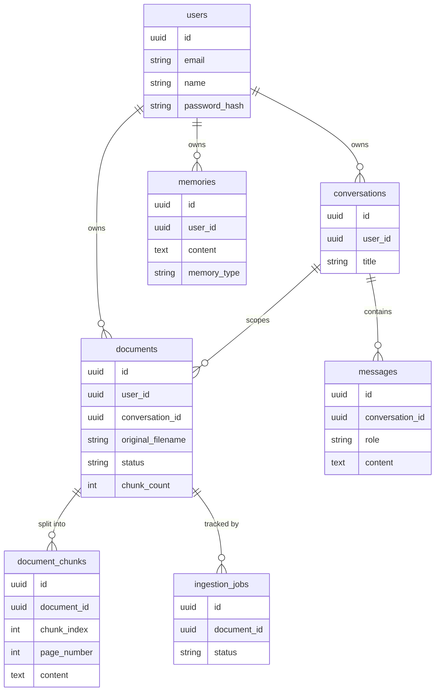

# Architecture

This document describes how Rorak AI is put together: the main components, how a chat request flows through the system, the data model, and the reasoning behind key design decisions.

## Overview

Rorak AI is a single FastAPI service backed by PostgreSQL and a local FAISS index, plus a static single-page frontend.

```text
┌──────────────┐  HTTPS + JWT   ┌──────────────────────── FastAPI ─────────────────────────┐
│  Web client  │ ─────────────► │ middleware: CORS · rate limit · request logging          │
│ (static SPA) │                │ routes ─► services ─► repositories ─► SQLAlchemy models  │
└──────────────┘                │                 │                                        │
                                │                 ├─► parsers ─► embeddings ─► FAISS       │
                                │                 └─► retriever ─► reranker ─► Groq LLM    │
                                └──────────────────────────────┬───────────────────────────┘
                                                               ▼
                                                         PostgreSQL
```

### Layers

| Layer | Location | Responsibility |
| --- | --- | --- |
| Routes | `backend/routes/` | HTTP contracts, auth dependencies, error mapping |
| Services | `backend/services/` | Business logic: chat orchestration, ingestion, memory, retrieval |
| Repositories | `backend/repositories/` | All database access, always scoped by owner |
| Models | `backend/models/db/`, `backend/models/schemas.py` | SQLAlchemy tables and Pydantic request/response schemas |
| Parsers | `backend/parsers/` | Format adapters producing a canonical `ParsedDocument` |
| RAG | `backend/rag/` | Embedding model, FAISS vector store, prompt templates |
| Core | `backend/core/` | Settings, DB session, JWT, auth dependencies, logging |

Routes never touch the database directly, and services never build HTTP responses. This keeps the business logic testable without a running server.

## Chat request lifecycle

`POST /chat/` with `{question, conversation_id?}`:

1. **Authenticate** — the bearer token is decoded and the user is loaded (`core/auth.py`). Any client-supplied user identifiers are ignored.
2. **Resolve the conversation** — an existing conversation is loaded with an ownership check, or a new one is created.
3. **Persist the user message.**
4. **Retrieve context** — only documents attached to *this* conversation are searched:
   - FAISS similarity search returns the top `RETRIEVAL_K` (10) chunks.
   - A cross-encoder reranks them and keeps the top `RERANK_TOP_K` (3).
5. **Load history and memory** — the last `CONTEXT_WINDOW_SIZE` messages (chronological) and up to `MEMORY_WINDOW_SIZE` long-term memories for the user.
6. **Assemble the prompt** — system instructions followed by XML-delimited sections: `<memory>`, `<conversation_history>`, `<context>` (marked untrusted), and `<question>`.
7. **Generate** — a Groq chat completion, with a retry on empty responses.
8. **Persist the assistant message** and update the conversation timestamp.
9. **Extract memories** — the user message is screened for durable facts (name, role, preferences); new, non-sensitive, non-duplicate facts are saved.

If the conversation has no documents, steps 4 and the `<context>` section are skipped and the model answers as a general assistant. If documents exist but don't contain the answer, the model is instructed to say so rather than guess.

## Document ingestion

`POST /documents/upload?conversation_id=…`:

1. Validate extension, MIME type, and size (`MAX_UPLOAD_SIZE_BYTES`).
2. Store the original file under `documents/<document_id>/original/` and compute a SHA-256 checksum.
3. Dispatch to a parser via the registry (by MIME type, then extension).
4. Split the parsed blocks into chunks (`CHUNK_SIZE` / `CHUNK_OVERLAP`).
5. Embed the chunks and add them to the FAISS index with `document_id` metadata; persist chunks to `document_chunks`.
6. Mark the document `indexed` (or `failed` with a reason).

Deleting a document removes its vectors, chunk rows, and stored file.

### Parsers

Every adapter implements `DocumentParser.parse(file_bytes, filename) -> ParsedDocument`, where a `ParsedDocument` is a list of typed `StructuredBlock`s (paragraph, heading, table, row, code) with metadata such as page number or heading path.

| Format | Adapter | Notes |
| --- | --- | --- |
| PDF | `adapters/pdf.py` | Multiple pypdf extraction strategies, per-page metadata |
| DOCX | `adapters/docx.py` | Paragraphs, tables, heading hierarchy |
| TXT | `adapters/txt.py` | UTF-8 / BOM / CP1252 / Latin-1 detection, binary rejection |
| Markdown | `adapters/markdown.py` | Heading hierarchy, fenced code blocks with language |
| CSV | `adapters/csv.py` | Delimiter sniffing, header normalization, one block per row, row cap |

Adding a format means writing one adapter and registering it in `parsers/registry.py`.

## Data model



Schema changes are managed with Alembic (`alembic/versions/`). Run `alembic upgrade head` after pulling.

## Security model

- **Authentication** — bcrypt password hashes; HS256 JWTs with configurable expiry. The app refuses to start in `production` with the default secret.
- **Authorization** — every repository query is filtered by the authenticated `user_id`; cross-user access returns `403`/`404`.
- **Prompt injection** — retrieved text is wrapped in a `<context>` block that the system prompt declares untrusted and non-executable.
- **Memory hygiene** — content matching API keys, bearer tokens, private keys, or passwords is rejected before storage.
- **Logging** — message contents are not logged; a log formatter redacts key-like strings.
- **Abuse protection** — in-memory per-IP sliding-window rate limiting (120 requests/minute); health probes are exempt.

## Design decisions and trade-offs

| Decision | Why | Trade-off |
| --- | --- | --- |
| Local FAISS index with metadata filtering | Zero extra infrastructure; fast on CPU | Single index file shared by all users; not horizontally scalable. pgvector is the planned replacement. |
| Synchronous ingestion in the API process | Simple, immediate feedback in the UI | Large uploads block a worker; a background queue is on the roadmap. |
| In-memory rate limiter | No Redis dependency | Limits are per process and reset on restart. |
| Documents scoped to conversations | Matches the chat-first UX and keeps retrieval focused | A file must be re-uploaded to use it in another chat. |
| Two-stage retrieval | Cross-encoder reranking improves precision over vector search alone | Additional CPU inference per query. |
| Vanilla JS frontend | No build step; trivially hostable on any static host | Less structure than a framework as the UI grows. |

## Further reading

Historical design notes and audits from the v2 development cycle are kept in [`docs/design-notes/`](design-notes/). They describe intermediate states (including the since-removed workspace feature) and are not authoritative for the current code.
