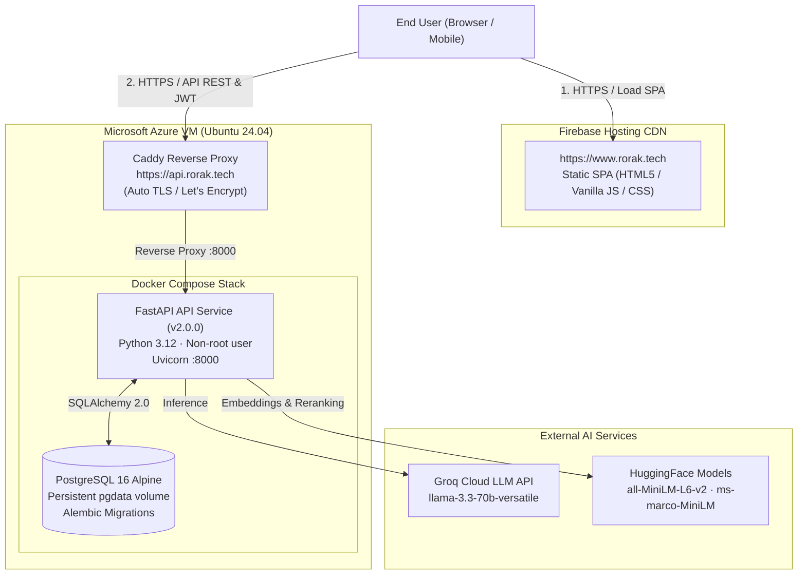

# Production Deployment Guide

This document describes the production infrastructure and deployment workflow for **Rorak AI v2.0**.

---

## Architecture Overview

Rorak AI uses a decoupled, dual-cloud architecture designed for global CDN frontend delivery and reliable containerized backend execution:



---

## Domain & DNS Configuration

| Hostname | Target / Type | Provider | Purpose |
| --- | --- | --- | --- |
| `rorak.tech` | `199.36.158.100` (A) | Firebase Hosting | Apex frontend redirect |
| `www.rorak.tech` | `199.36.158.100` (A) | Firebase Hosting | Primary production frontend UI |
| `api.rorak.tech` | `40.81.235.17` (A) | Microsoft Azure VM | Production backend REST API & Docs |

---

## 1. Backend Deployment (Microsoft Azure VM)

### Prerequisites
- Ubuntu 24.04 LTS VM instance with public IP.
- Ports `80` (HTTP), `443` (HTTPS), and `22` (SSH) open in the Azure Network Security Group (NSG).
- Docker Engine & Docker Compose plugin installed.
- Caddy web server installed for automated TLS certificate management.

### Environment Configuration
On the Azure VM, configure `/home/azureuser/rorak_ai/.env` with production secrets:

```env
ENVIRONMENT=production
LOG_LEVEL=INFO
DATABASE_URL=postgresql+psycopg://rorak:rorak@db:5432/rorak
JWT_SECRET_KEY=<generate_secure_64_char_random_key>
JWT_ALGORITHM=HS256
ACCESS_TOKEN_EXPIRE_MINUTES=1440
GROQ_API_KEY=gsk_your_groq_api_key_here
GROQ_MODEL=openai/gpt-oss-20b
EMBEDDING_MODEL=sentence-transformers/all-MiniLM-L6-v2
RERANKER_MODEL=cross-encoder/ms-marco-MiniLM-L-6-v2
CHUNK_SIZE=500
CHUNK_OVERLAP=50
RETRIEVAL_K=10
RERANK_TOP_K=3
CONTEXT_WINDOW_SIZE=10
MEMORY_WINDOW_SIZE=5
MAX_UPLOAD_SIZE_BYTES=10485760
```

### Launching the Stack
From the repository root on the VM:

```bash
# Pull latest changes
git pull origin main

# Build and start services in the background
docker compose up -d --build

# Run Alembic migrations (handled automatically on startup, or verify manually)
docker compose exec api alembic upgrade head
```

### Caddy Reverse Proxy & TLS
`/etc/caddy/Caddyfile`:

```caddy
api.rorak.tech {
    reverse_proxy 127.0.0.1:8000 {
        header_up Host {host}
        header_up X-Real-IP {remote_host}
        header_up X-Forwarded-For {remote_host}
        header_up X-Forwarded-Proto {scheme}
    }
}
```

Reload Caddy after configuration:
```bash
sudo systemctl reload caddy
```

---

## 2. Frontend Deployment (Firebase Hosting)

The frontend is a lightweight Single Page Application (SPA) requiring zero Node runtime dependencies.

### Deploying Updates
```bash
# 1. Install Firebase CLI (if not already installed)
npm install -g firebase-tools

# 2. Authenticate
firebase login

# 3. Select project
firebase use rorak-9axk

# 4. Deploy static frontend assets
firebase deploy --only hosting
```

The live frontend automatically discovers `https://api.rorak.tech` via domain-based detection in [frontend/script.js](../frontend/script.js).

---

## 3. Monitoring & Health Verification

Verify deployment health from any terminal:

```bash
# Liveness probe (verifies FastAPI process is running)
curl -s https://api.rorak.tech/health/

# Readiness probe (verifies database connectivity and model initialization)
curl -s https://api.rorak.tech/ready/
```

Expected readiness output:
```json
{
  "status": "ready",
  "models_loaded": true,
  "vector_store_initialized": true,
  "database_connected": true,
  "documents_indexed": 0,
  "chunks_indexed": 0
}
```

Interactive Swagger API documentation is accessible at:
- [https://api.rorak.tech/docs](https://api.rorak.tech/docs)
- [https://api.rorak.tech/redoc](https://api.rorak.tech/redoc)
